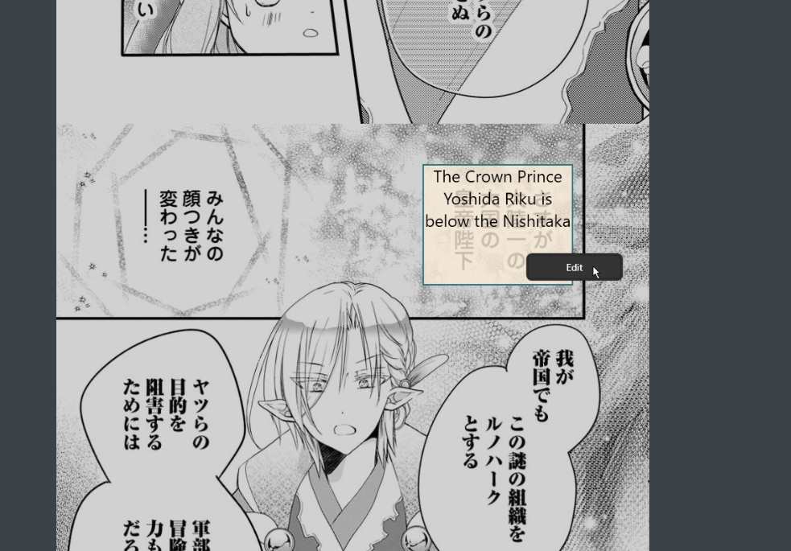
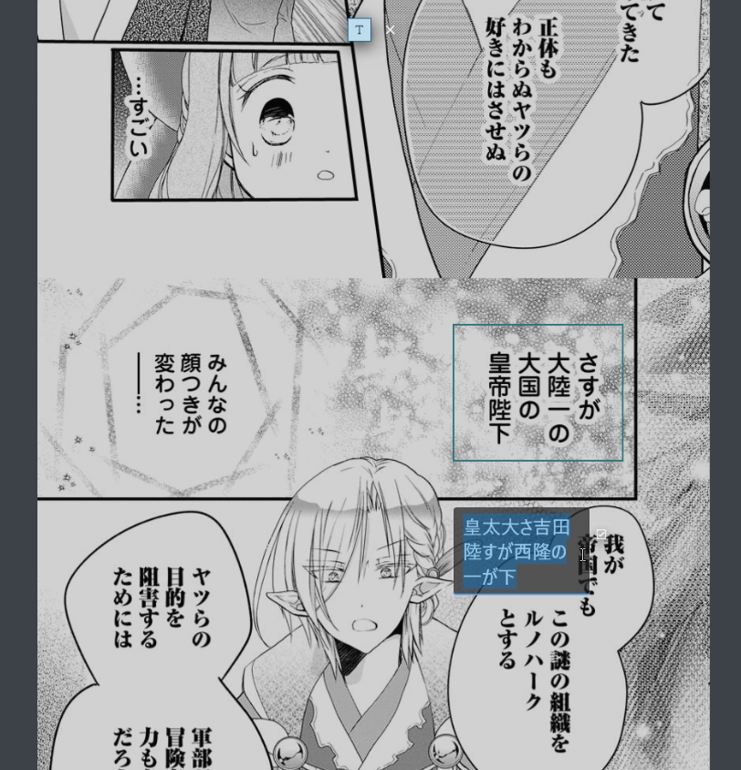
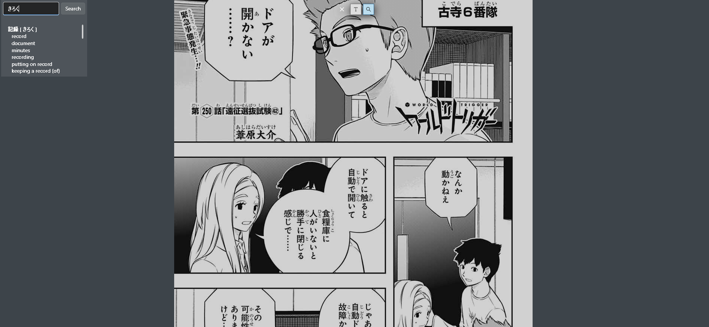

# J2E OCR Translator

J2E OCR Translator is a Windows desktop application built with WPF (.NET 8) for translating Japanese text from images to English. It features OCR (Optical Character Recognition) using both Manga OCR and a custom OCR model, and integrates translation via Google Translate and DeepL APIs. The app also provides a built-in Japanese-English dictionary search.

## Features

- **Screen Region Selection:** Select any region of your screen to capture and extract Japanese text.
- **OCR Models:** Toggle between Manga OCR and a custom OCR model for text recognition.
- **Translation:** Instantly translate recognized Japanese text to English using Google Translate or DeepL.
- **Dictionary Lookup:** Search for Japanese words and view readings and meanings.
- **Editable Results:** Edit OCR results and re-translate as needed.
- **Modern UI:** Uses WPF-UI for a clean, dark-themed interface.

## Screenshots

### Display Translation



### Edit OCR Text



### Dictionary Search



## Getting Started

1. **Requirements:**
   - Windows 10/11
   - .NET 8.0 SDK
   - Python 3.12 (for OCR integration)
   - Required Python packages: `transformers`, `torch`, `Pillow`, `jaconv`, `loguru`, etc.

2. **Setup:**
   - Clone the repository.
   - Install NuGet dependencies (`dotnet restore`).
   - Configure your API keys for Google Translate and DeepL in a `.env` file:
     ```
     DEEPL_API_KEY=your_deepl_key
     GOOGLE_API_KEYS=your_google_key
     ```
   - Ensure your Python environment and OCR models are set up as referenced in `custom_ocr/ocr.py`.

3. **Run:**
   - Build and launch the app:
     ```
     dotnet build
     dotnet run --project WpfAppTest.csproj
     ```

## Usage

- **Select Region:** Click and drag to select a region of the screen.
- **OCR & Translate:** The app will extract Japanese text and translate it to English.
- **Edit & Re-translate:** Double-click the translation to edit the original text and update the translation.
- **Dictionary Search:** Use the search panel to look up Japanese words.

## Project Structure

- `MainWindow.xaml` / `.cs`: Main UI and logic.
- `MangaOCR.cs`: Python OCR integration via pythonnet.
- `Translate.cs`: Translation API integration.
- `DictionaryLookup.cs`: Japanese-English dictionary search.
- `custom_ocr/`: Python custom OCR implementation.

## License

This project is for educational and personal use. Please respect third-party API terms and model licenses.

## Credits

- [Manga OCR](https://github.com/kha-white/manga-ocr)
- [DeepL](https://www.deepl.com/)
- [Google Translate](https://cloud.google.com/translate)
- [WPF-UI](https://github.com/lepoco/wpfui)